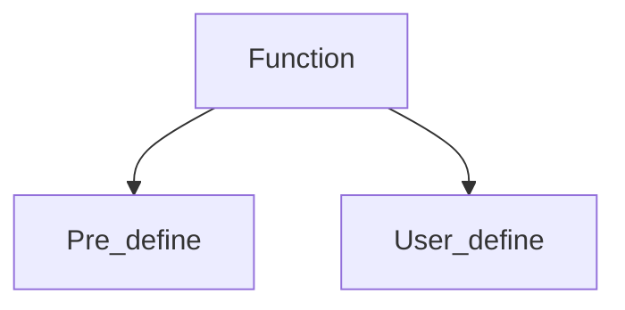

___
___

### What is function?
> Function are group of code or program which is used more often.

> It leads programming to code reusability and clean code. 
#### Types of Function :

>Pre define--> Such Functions Are define at the time of making of any language;

>User define--> Such function are define by users according to their needs;
#### Syntax of function in javaScript :
* name : just like a variable where we call "var" and give that a name. to create a function. we call "function" and given it a name in the same way.
  
  ```html
  Syntax : 
  function <Function_name>(){
    //function body
  }
  ```
  * Argument : these are the inputs that the function will manipulate separate multiple inputs that commas.
  ```s
  Syntax :
  function <function_name>(a,b){
    //function body
    }
    ```
|Code|
|-|
```html
<!DOCTYPE html>
<html lang="en">
<head>
    <meta charset="UTF-8">
    <meta http-equiv="X-UA-Compatible" content="IE=edge">
    <meta name="viewport" content="width=device-width, initial-scale=1.0">
    <title>Document</title>
</head>
<body>
    <input type="text" name="name" id="name">
    <button onclick="greet()">
        greet
    </button>
    <div class="greet"></div>
</body>
<script type="text/javascript">
    function greet(){
         var name = document.getElementById('name').value;
         var string = "hello "+name;
         //alert(name);
         document.getElementsByClassName('greet')[0].innerHTML = string;
    }
</script>
</html>
```
#### Simple calculation using function in js :
> Create simple calculator

```html
<!DOCTYPE html>
<html lang="en">
<head>
    <meta charset="UTF-8">
    <meta http-equiv="X-UA-Compatible" content="IE=edge">
    <meta name="viewport" content="width=device-width, initial-scale=1.0">
    <title>Document</title>
</head>
<body>
    <input type="number" name="first" id="first" step="any">
    <select id="ope">
        <option value="+">+</option>
        <option value="-">-</option>
        <option value="*">*</option>
        <option value="/">/</option>
        <option value="%">%</option>
    </select>
    <input type="number" name="second" id="second" step="any"><br><br>
     <button onclick="cal()">calculate</button>
    <input type="text" name="res" id="res" readonly="">
</body>
<script type="text/javascript">
    function cal(){
        var ope1 = document.getElementById('first').value;
        var ope2 = document.getElementById('second').value;
        var ope = document.getElementById('ope').value;
        if(ope == '+'){
            var res = parseInt(ope1) + parseInt(ope2);
        }
        if(ope == '-'){
            var res = parseInt(ope1) - parseInt(ope2);
        }
        if(ope == '*'){
            var res = parseInt(ope1) * parseInt(ope2);
        }
        if(ope == '/'){
            var res = parseInt(ope1) / parseInt(ope2);
        }
        if(ope == '%'){
            var res = parseInt(ope1) % parseInt(ope2);
        }
        document.getElementById('res').value = res;
    }
</script>
</html>
```  