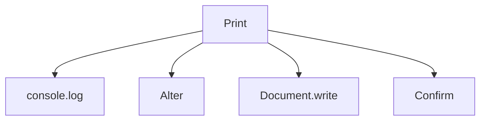

___
___
# JavaScript
___
___
## What is JavaScript?
* JavaScript is an interpreted, client-based, object-oriented scripting language.
* Invented in 1995 at Netscape.
* corporation(LiveScript).
* javascript can dynamically modify and HTML page.
* javascript can validate user input javascript can validate user input.
* javascript can validate user input.
* javascript is a full-featured programming language.
* javascript user interaction oes not require any communication with server.
#### What make javascript unique?
>support by all major browsers and enabled by default.
>>complex thing are done simply.
>>>full integration with HTML/css.

#### Javascript frameworks and libraries.
1. Angular
2. jQuery
3. Ext.js
4. Node.js
5. Aurelia
6. React
7. Vue.js
8. Ember.js
9. Polymer
10. Backbone.js
  
#### Way to Print :


___
#### console.log()
* used in debugging to code.

Syntax : console.log()
  
```html
<!DOCTYPE html>
<html lang="en">
<head>
    <meta charset="UTF-8">
    <meta http-equiv="X-UA-Compatible" content="IE=edge">
    <meta name="viewport" content="width=device-width, initial-scale=1.0">
    <title>Document</title>
    <script type="text/javascript">
        console.log("Hello world")
    </script>
</head>
<body>
    
</body>
</html>
```

#### alert() 
* the alert() method display an alter box over the current window with the specified message.
* it is used to alert the user that something has happened.

Syntax : alert("Hello World")

```html
<!DOCTYPE html>
<html lang="en">
<head>
    <meta charset="UTF-8">
    <meta http-equiv="X-UA-Compatible" content="IE=edge">
    <meta name="viewport" content="width=device-width, initial-scale=1.0">
    <title>Document</title>
    <script type="text/javascript">
        console.log("Hello world")
        alert("hello world")
    </script>
</head>
<body>
    
</body>
</html>
```

#### document.write()
* used when you want to print to content to the HTML content.

> Syntax : document.write("hello world")

```html
<!DOCTYPE html>
<html lang="en">
<head>
    <meta charset="UTF-8">
    <meta http-equiv="X-UA-Compatible" content="IE=edge">
    <meta name="viewport" content="width=device-width, initial-scale=1.0">
    <title>Document</title>
    <script type="text/javascript">
        console.log("Hello world")
        alert("hello world")
        document.write("<h1> hello<h1>");
    </script>
</head>
<body>
    
</body>
</html>
```
#### confirm()
* opens up a confirm/cancel dialog and return true/false depending on user's click.
>confirm("0xaman47");
---
### Prompt Function using input with user :

```html
<!DOCTYPE html>
<html lang="en">
<head>
    <meta charset="UTF-8">
    <meta http-equiv="X-UA-Compatible" content="IE=edge">
    <meta name="viewport" content="width=device-width, initial-scale=1.0">
    <title>Document</title>
</head>
<body>
    Name : <i id="res"></i><br><br>
    <button onclick="call()">Click</button>
</body>
<script type="text/javascript">
    function call(){
        var name = prompt("Enter your name : "," ");
        document.getElementById('res').innerHTML = name;
    }
</script>
</html>
```
