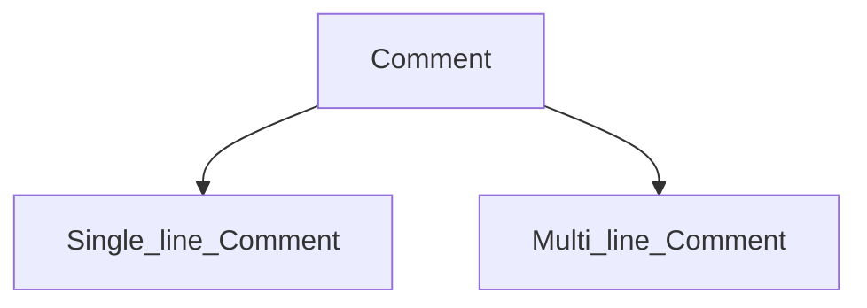

### Comment :
> The javaScript comments are meaningful way to deliver message. 
> it is used to add information about the code, warnings or suggestion so that end user can easily interpret the code.

##### Advantages of javaScript comment :
> To make code easy to understand
> to avoid the unnecessary code


#### Single Line Comment :
* it is represented by double forward slashes(//).
* it can be used before and after the statement.
```html
<script>
    //it is single line comment
    document.log("hello 0xaman47");
</script>
```

#### Multi line Comment :
* it can be used to add single as well as multi line comment. so it is more convenient.
* it is represented by forward slash with asterisk then asterisk with forward slash.
```html
<script>
    /* it is multi line comment
    it will not be display*/
    document.log("hello 0xaman47");
</script>
```
    