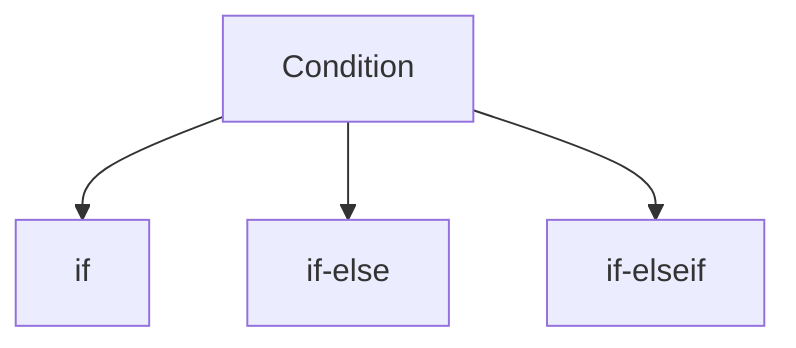

___
___
### What is Conditional Statement : 
>Conditional Statement(control statement) used to change the flow of the program's execution.
>> Two posable cases, either true or false.
#### Types of conditional statement id js :

* if : if proved true function or display info.

* if-else : 
  * if proved true ,performs a task
  * if false perform any other task.

* if-elseif : 
   * if proved true , perform a task
   * if false check another if condition. 
  
##### Syntax of Conditional statement :
###### if :
```Syntax```

```js
if (condition){
    // if condition is true
}
```
```Code```
```html
<!DOCTYPE html>
<html lang="en">
<head>
    <meta charset="UTF-8">
    <meta http-equiv="X-UA-Compatible" content="IE=edge">
    <meta name="viewport" content="width=device-width, initial-scale=1.0">
    <title>Document</title>
</head>
<body>
    
</body>
<script type="text/javascript">
    var age = 20;
    if(age > 18){
        document.write("<h1>True</h1>");
    }
</script>
</html>
```
###### if-else :
```Syntax```

```s
if(condition){
    //if the condition is true
}
else{
    //if condition is false
}
```
```Code```
```html
<!DOCTYPE html>
<html lang="en">
<head>
    <meta charset="UTF-8">
    <meta http-equiv="X-UA-Compatible" content="IE=edge">
    <meta name="viewport" content="width=device-width, initial-scale=1.0">
    <title>Document</title>
</head>
<body>
    
</body>
<script type="text/javascript">
    var age = 20;
    if(age < 18){
        document.write("<h1>True</h1>");
    }
    else{
        document.write("<h1>False</h1>");
    }
</script>
</html>
```
###### if-else-if :
```Syntax```
```s
if(condition){
    //if condition is true
}
else if(condition){ 
   //1st condition is false executed 2nd condition
}
else{
  //all condition is false go false statement
}
```
```Code```
```html
<!DOCTYPE html>
<html lang="en">
<head>
    <meta charset="UTF-8">
    <meta http-equiv="X-UA-Compatible" content="IE=edge">
    <meta name="viewport" content="width=device-width, initial-scale=1.0">
    <title>Document</title>
</head>
<body>
    
</body>
<script type="text/javascript">
    var age = prompt("Enter the age");
    if(age == 18){
        document.write("<h1>eligible to booting</h1>");
    }
    else if(age > 18 && age < 30){
        document.write("<h1>eligible marred to </h1>");
    }
    else{
        document.write("false");
    }
</script>
</html>
```
